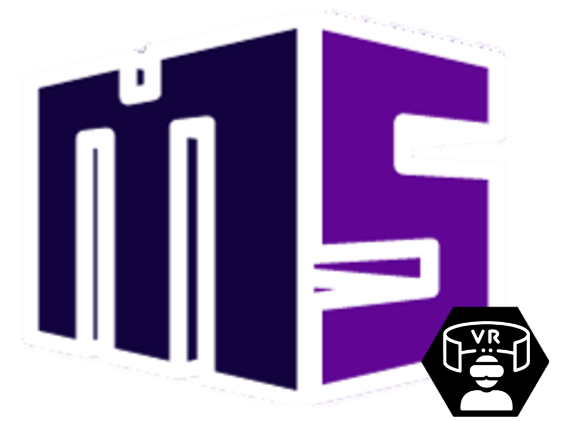
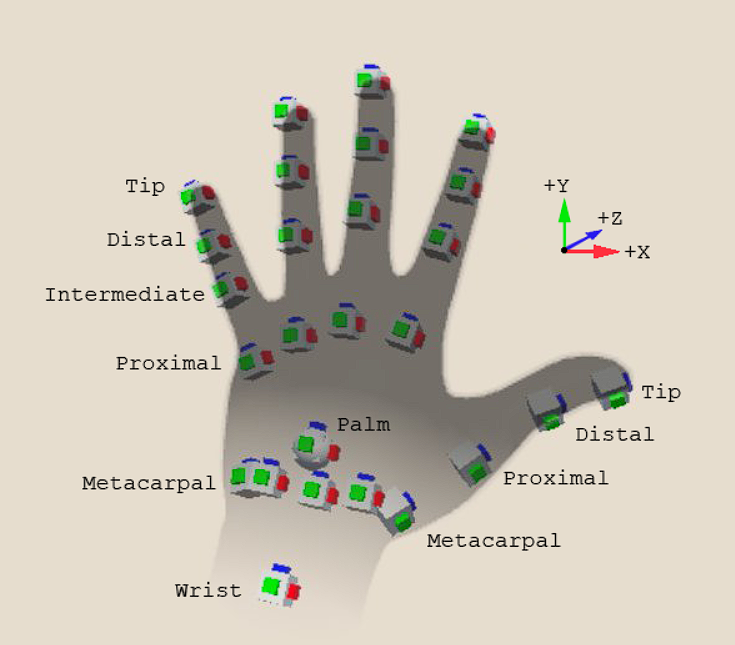
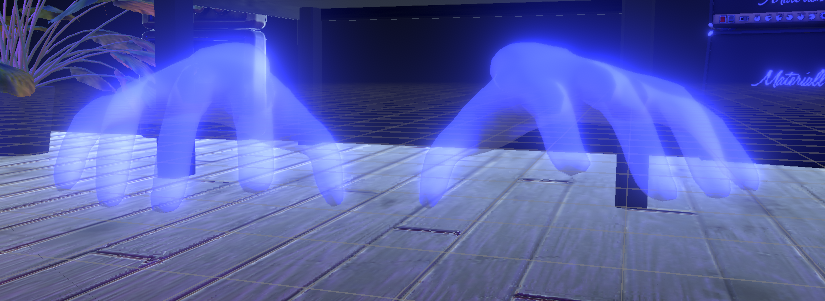
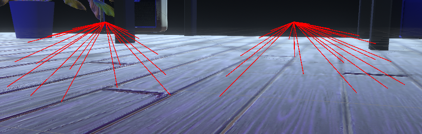
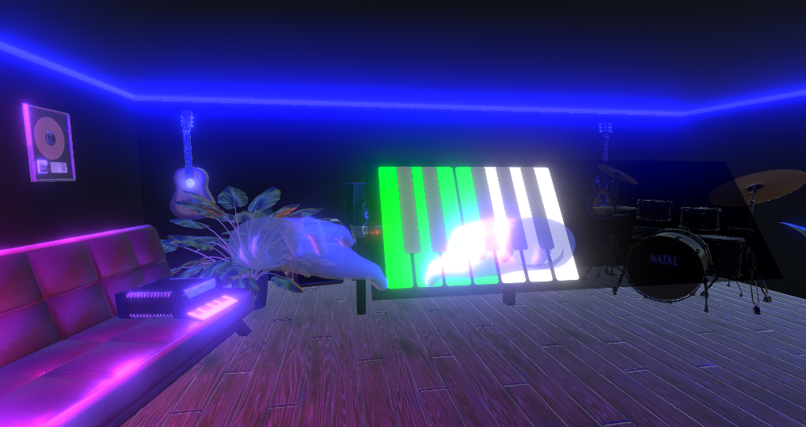
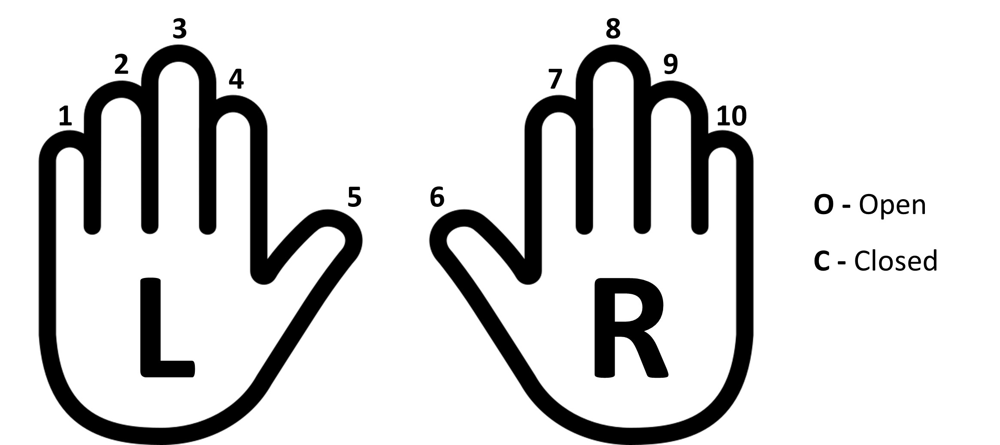
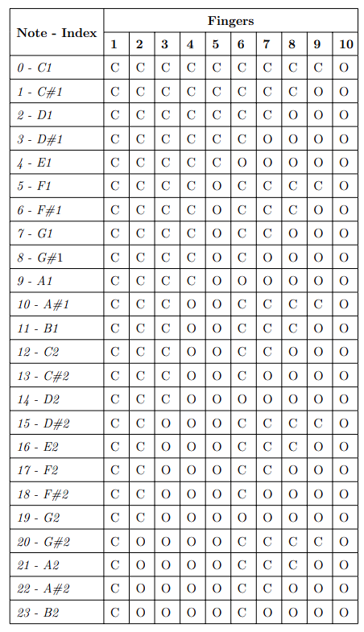

# MarcoSmilesVR

## Project Overview

MarcoSmiles was conceived in 2016 within the Laboratory of Musimatics at the University of Salerno,
with the ambitious aim of exploring new techniques of human-computer interaction in the context of musical performances. This innovative platform is characterised by the possibility to fully customise the performance of a virtual musical instrument through the natural movement of the hands. MarcoSmiles integrates a MIDI management module, allowing the system to be used with any device equipped with a MIDI interface.

The integration of virtual reality provides MarcoSmiles with a significant advantage,
transforming the musical experience into an immersive experience. 
Users can have the opportunity to experiment with music in an immersive three-dimensional environment,
which attempts to reproduce a recording studio as faithfully as possible, where hand movements become the means to explore and shape one's own musical creation.
This fusion of technology and virtual reality amplifies human-machine interaction,
enabling a deeper connection between the user and the system. In this context, 
virtual reality is not just an upgrade but a transformation that elevates MarcoSmiles to a higher 
level of musical expression and opens up different scenarios for improvement.

## New Features
In previous versions, one or more _Leap Motion_ was used to capture hand information. 
However, this dynamic has changed in the VR version, where the use of different technologies 
related to the augmented reality visor, including the **integrated hand tracking functionality**, 
enables a new approach. Now, instead of using an additional device such as the Leap Motion, 
**the system makes use of the hand tracking subsystem already built into the visor**.

Another fundamental evolution concerns the **restructuring of the neural network** used, 
with a specific focus on the **type of learning implemented**. In the current version, 
we have abandoned the traditional approach to embrace a more advanced model: **reinforcement learning,
with a special emphasis on the implementation of Q-learning**.

## Built with

## Table of contents ##
<!-- TOC -->
* [MarcoSmilesVR](#marcosmilesvr)
  * [Project Overview](#project-overview)
  * [New Features](#new-features)
  * [Built with](#built-with)
  * [Getting Started](#getting-started)
  * [Import the Unity Project](#-import-the-unity-project-)
      * [From "Package Manager" download and install:](#from-package-manager-download-and-install-)
  * [Install Python Libraries](#-install-python-libraries-)
  * [Feature extraction](#feature-extraction-)
  * [Unity Scenes](#unity-scenes-)
    * [Training scene](#training-scene-)
    * [PlayScene](#playscene-)
  * [Reinforcement Learning](#reinforcement-learning-)
    * [Creation of training and testing dataset](#creation-of-training-and-testing-dataset-)
    * [Q-learning](#q-learning-)
    * [Double Deep Q Learning](#double-deep-q-learning-)
    * [Step for the training](#step-for-the-training-)
<!-- TOC -->

## Getting Started

##   Import the Unity Project ##
1. **Open Unity and create a new project:**
    - Launch Unity and select "New Project".

2. **Go to "Assets" and select "Import Package" > "Custom Package":**
    - In the Unity window, go to "Assets" in the menu bar.
    - Select "Import Package" and then choose "Custom Package".

3. **Choose the package to import:**
    - Navigate through your file system and select the Unity package (`MarcoSmilesOculusIntegration.unitypackage`) you downloaded from repo.

4. **Select the assets to import:**
    -  You  will see a list of all the assets in the package.
    - Ensure you selected all the assets.

5. **Click "Import".**

At this point, your project has been successfully imported, but there are additional steps required to complete the entire process.

#### From "Package Manager" download and install: ####

    - XR Plugin Managment (v 4.4.0)
    - XR Core Utilities (v 2.2.3)
    - XR Hands (v 1.3.0)
    - XR Interaction Toolkit (v 2.5.2)

##   Install Python Libraries ##
The libraries being installed henceforth are exclusively intended for deployment in the reinforcement training phase, 
given that Unity lacks native Python support. As of now, the wrapper enabling the 
utilization of trained agents within Unity remains unimplemented. Consequently, 
these libraries are deployed for research endeavors, aimed at discerning 
the optimal solution for MarcoSmiles.

`pip install numpy==2.1.4 pandas==1.26.2 
scikit-learn==1.3.2 matplotlib==3.8.2 torch==2.1.1 gym==0.26.2`

## Feature extraction ##
The information concerning hand positions is acquired through the hand tracking 
subsystem of the Meta Quest 3. Once acquired, it is processed using the XRHands 
package, which enables investigation into the position of each hand joint.

In the next stage of our methodology, a fundamental calculation is performed, namely the
determination of the distance of each joint from the palm, with the exception of the wrist.
This calculation results in a set of data that intricately delineates the characteristics
of a given hand configuration.

      THUMB
         |-ThumbMetacarpalDistance
         |-ThumbProximalDistance
         |-ThumbIntermediateDistance
         |-ThumbDistalDistance
         |-ThumbTipDistance
      INDEX
         |-IndexMetacarpalDistance
         |-IndexProximalDistance
         |-IndexIntermediateDistance
         |-IndexDistalDistance
         |-IndexTipDistance
      MIDDLE
         |-MiddleMetacarpalDistance
         |-MiddleProximalDistance
         |-MiddleIntermediateDistance
         |-MiddleDistalDistance
         |-MiddleTipDistance
      RING
         |-RingMetacarpalDistance
         |-RingProximalDistance
         |-RingIntermediateDistance
         |-RingDistalDistance
         |-RingTipDistance
      LITTLE
         |-LittleMetacarpalDistance
         |-LittleProximalDistance
         |-LittleIntermediateDistance
         |-LittleDistalDistance
         |-LittleTipDistance

## Unity Scenes ##
### Training scene ###
The training scene facilitates the correlation of specific musical notes with corresponding hand positions. 
Within the scene, a panel is provided for the selection of the note to be trained. Once selected, 
a countdown initiates, during which the desired hand position must be assumed. Upon completion, 
the features pertaining to the recorded note are then stored.
After registering a note, it will be displayed in green on the virtual keyboard.

The dataset will be utilized and customized to perform one of the following operations based on different approaches:

1. **Threshold-based Method:**
   In this approach, features related to hand positions correlated with musical notes are meticulously stored.
   Subsequently, a threshold is defined as a comparison parameter. During actual use, current hand positions are 
   compared with those previously recorded in the dataset.

2. **Reinforcement Learning-based Method:**
   This approach harnesses the power of machine learning through the use of ML-Agents (Machine Learning Agents).
   Through continuous training and optimization of machine learning agents, MarcoSmiles can progressively enhance 
   its ability to intelligently interpret various hand positions and actions. 
   Two approaches have been explored:
   using the _**ML-Agents Toolkit**_ and implementing a **_Q-Learning script using Python_**.

In the first scenario, the dataset will remain unchanged, while in the second, _**data augmentation**_ will be performed 
to generate additional samples without extending the duration of the hand position recording phase.

### PlayScene ###
Currently, the development stage of the PlayScene is still ongoing,as the determination of the methodology
to be adopted for the aforementioned functionality has not yet been finalized. 
Within Unity's "_Assets_," there is a partially implemented "_**Main Scene**_" that, at the moment, 
lacks a fully realized graphical interface but is primarily dedicated to experimenting with the
**threshold-based method**. In this scene, _**a display has already been integrated to show the predicted note**_,
and a **_basic Synth has been implemented**_ to facilitate the testing and evaluation process of the system.

Regarding the reinforcement learning-based approach (_**Q-Learning**_), 
it's worth noting that Unity currently doesn't offer native support for Python.
Therefore, all experiments are currently conducted through the implementation of Python scripts.
The C# library named _**TorchSharp**_ has been identified and will be used to integrate the trained
agent within the Unity environment.

## Reinforcement Learning ##
Before proceeding to the training phase, certain steps are required to assemble the training module. 
Download the "Training Module" directory from the repository and paste it in the desired location. 
The directory structure is as follows:
      
       ├── utils
          ├── DDQN
          │   ├── basic_buffer.py
          │   ├── Double_DQN.py
          │   ├── DQN.py
          │   ├── MSenv.py
          │   └── Test.py
          │
          ├── QLearning.py
          ├── Test_QLearning.py
          ├── QLearningForFinger.py
          ├── Test_QLearningForFinger.py
          ├── DataAugmentation.py
          ├── DatasetReducer.py
          ├── TestThreshold.py
       ├── HGMSD_12.csv
       ├── HGMSD_24.csv
       ├── MGMSD_12.csv
       ├── MGMSD_24.csv
       ├── min_max_distance.csv
       ├── open_close_starter_data.csv
       ├── TestDataset12.csv
       ├── TestDataset24.csv

#

### Q-learning ###
Q-Learning is a reinforcement learning technique designed for optimal decision-making 
and it revolves around the concept of a Q-value,
representing the expected cumulative reward associated with taking a particular action in a specific state.
The algorithm iteratively updates Q-values based on observed rewards, 
guiding the agent towards making optimal decisions.

The scripts facilitate the training and testing of an agent based on Q-Learning.
Throughout the training phase, a Q-Table is generated, containing, for each state, the recommended action.
This table is saved in a CSV file for subsequent use during execution.
The Q-Table serves as a comprehensive reference,
enabling the agent to make informed decisions based on learned optimal
actions for each state encountered.

### Deep Q-Learning (DQN) & Double Deep Q-Learning (Double DQN)
_Deep Q-Learning (DQN)_ uses a deep neural network to approximate the Q-function 
instead of a Q-Table, enabling handling of larger state and action spaces. 
It employs techniques like experience replay and target Q to improve training stability and convergence.
Experience replay randomly samples past experiences to reduce correlations and enhance effectiveness, 
while target Q uses two networks, online and target, with the target periodically updated with 
the weights of the online.

_Double Q-Learning_ addresses the problem of overestimation bias in Q-learning by using two _Q-functions_ (_or two DNN_) 
updated with values from each other. This approach mitigates overestimation by ensuring each function
learns from different sets of experiences. _Double Deep Q-Learning (Double DQN)_ combines _DQN_ and _Double 
Q-Learning_, utilizing two networks (online and target) to evaluate actions for the next state. 
While similar to DQN, Double DQN selects actions via the online network and evaluates them using the 
target network, thereby refining the learning process.

- **DQN.py**: implements  Deep Q-Learning.
- **DDQN.py**: implements Double Deep Q Learning.
- **MSenv**: represents the training environment used.
- **Test_DDQN**: allows for the evaluation of the trained model 
(generates a confusion matrix plot for performance analysis of the model).

### Type of datasets
#### Single Instances MarcoSmiles’s Dataset (SIMSD)
Dataset created for the operation of the threshold-based method, consisting of one instance per hand configuration. Two versions of the dataset were created:
- **SIDMS-12**: containing data for a single octave, consisting of a total of 12 instances;
- **SIDMS-24**: containing data relating to two octaves, made up of 24 instances.

<blockquote> 
To create this type of dataset, it is necessary to:

>- Access the Training Scene in the Unity editor.
>- Navigate to the <code>XRInitializer -&gt; HandDataRecorder</code> game object.
>- Uncheck the box next to the <code>record more instances</code> variable.
>- Perform the recording phase; the dataset will be saved in MarcoSmiles' working directory.

</blockquote>

#### Human Generated MarcoSmiles’s Dataset (HGMSD)
   Dataset designed for training agents used in reinforcement learning approaches. It contains for each configuration 500 instances sampled at a rate of 50 recordings per second. As with the previous dataset, two versions were created:
- **HGMSD-12**: containing the data for a single octave, consisting of 6000 instances;
- **HGMSD-24**: containing data relating to two octaves, constituted by 12000 instances.

<blockquote>
To create this type of dataset, it is necessary to:

>- Access the Training Scene in the Unity editor.
>- Navigate to the <code>XRInitializer -&gt; HandDataRecorder</code> game object.
>- Check the box next to the <code>record more instances</code> variable.
>- Set the <code>Number_of_istances</code> variable
>- Perform the recording phase; the dataset will be saved in MarcoSmiles' working directory.

</blockquote>

#### Machine Generated MarcoSmiles’s Dataset (MGMSD)
   The aim of this dataset is to provide a sufficient data collection for the training of intelligent agents by minimizing the time required for the dataset creation phase as much as possible. The methodology used has been explained in detail in section 4.3.1 and seeks to create several instances from a single gesture sampling. Two datasets were created:
- **MGMSD-12**: single octave data (6000 instances);
- **MGMSD-24**: two octave data (12000 instances).
<blockquote>
To create this type of dataset, it is necessary to:

>- Create a SIMSD.
>- Use the script <code>DataAugmentatiopn.py</code>.
>- The MGMSD will be saved in the working directory.

</blockquote>

In order to obtain a fair evaluation, the same gestures were used for all
datasets. The HGMSD datasets were generated first and then derived from
the SIMSD datasets by obtaining the first sampling for each gesture. The
MGMSD datasets were then derived from the SIMSD datasets. The following
table outlines the gestures associated with each note.

### Step for the training and testing of Threshold approach

1. Generate SIMDS or use an existing one.
2. Open Unity navigate to Play Scene to test.
3. To have a visual feedback it is possible to navigate to the Poses gameobject and check, for each pose the variable <code>Visualize Features</code>
4. It is possible to test this method outside of Unity using the Python script <code>TestThreshold</code>.
---

### Step for the training and testing of QLearning approach

1. Generate HGMSD/MGMSD or use an existing one.
2. Start training using `QLearning.py` or `QLearningForFinger.py` depending on the desired method
3. Start testing using `Test_QLearning.py` or `QLearningForFinger.py` using the generated agent

---
### Step for the training and testing of DQN or DoubleDQN approach

1. Generate HGMSD/MGMSD or use an existing one.
2. Start training using `Double_DQN.py` or `DQN.py` depending on the desired method
3. Start testing using `Test.py` using the generated agent

---

Developed by 
Salerno Daniele

