# Appendix – Detailed Experimental Results

The following experiments were conducted to evaluate the performance of the proposed framework in recognizing hand poses. A dedicated dataset, **Human Generated MarcoSmiles's Dataset (HGMSD)**, was designed to simulate user movements during the training of the reinforcement-learning agent. Each hand configuration contains 500 samples acquired at 50 FPS. Two variants were generated:

- **HGMSD-12**: one-octave dataset (6000 instances)  
- **HGMSD-24**: two-octave dataset (12000 instances)

The hand poses correspond to those reported in Table *Gestures*.

---

## TQ-Learning – HGMSD-24

### 2B (0-1)

| Accuracy  |  Precision  |
|:---------:|:-----------:|
|  18.44%   |   14.70%    |

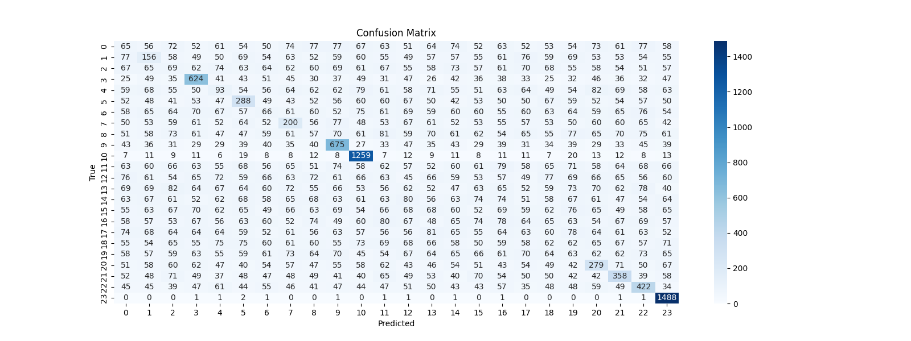

---

### 3B (0-2)

| Accuracy | Precision |
|:---------:|:-----------:|
| 16.99%  | 13.33%    |

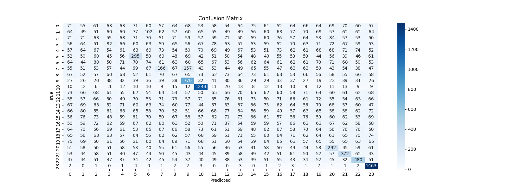

---

### 4B (0-3)

| Accuracy | Precision |
|:---------:|:-----------:|
| 17.77%  | 14.00%    |

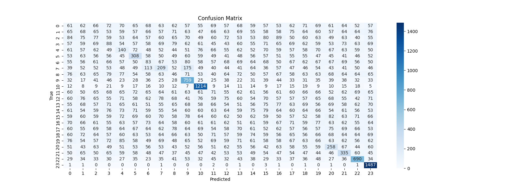

---

### 10B (0-9)

| Accuracy | Precision |
|:---------:|:-----------:|
| 15.23%  | 12.17%    |

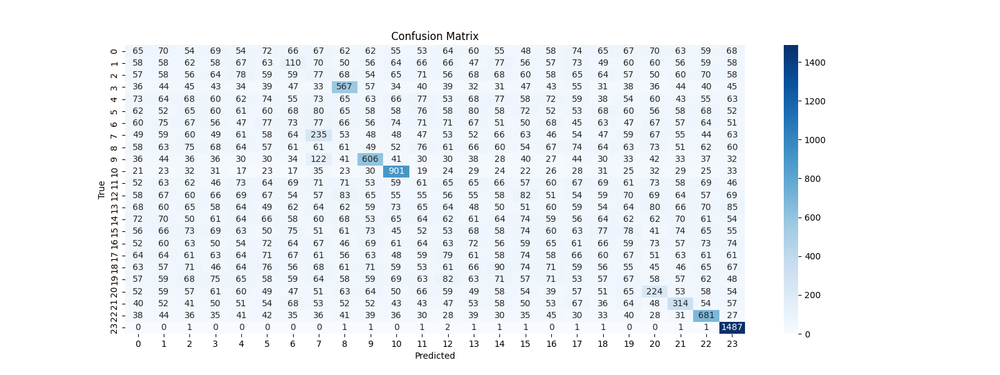

---

### 50B (0-49)

| Accuracy | Precision |
|:---------:|:-----------:|
| 11.16%  | 9.15%     |

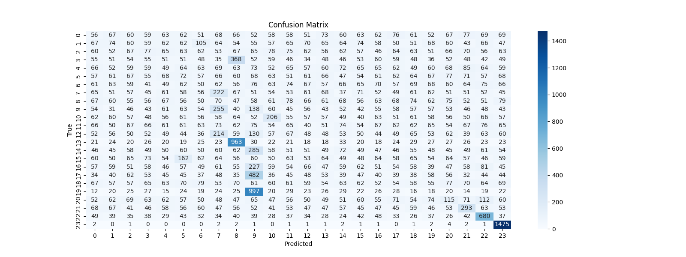

---

## Optimization in the Discretization Phase

An analysis of feature distribution revealed that several bins produced excessively narrow intervals, generating quantization errors and limited discriminative capability. This suggested that those features—showing minimal variability between open and closed hand configurations—contribute marginally to prediction.

A new experiment was conducted using only the **20 features with the largest dynamic range**, discarding the remaining ones.

---

## TQ-Learning – HGMSD-24 – 20 Features

### 2B (0-1)

| Accuracy | Precision |
|:---------:|:-----------:|
| 85.25%  | 80.09%    |

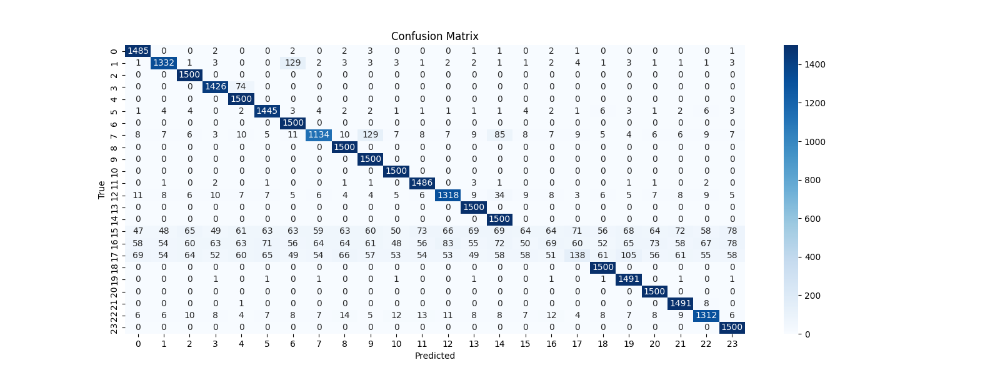

---

### 3B (0-2)

| Accuracy | Precision |
|:---------:|:-----------:|
| 81.81%  | 77.72%    |

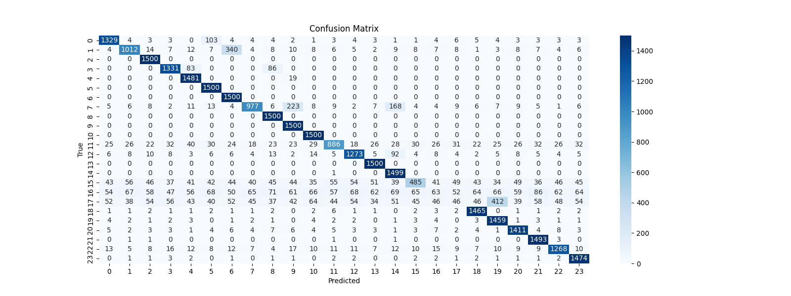

---

### 4B (0-3)

| Accuracy | Precision |
|:---------:|:-----------:|
| 75.13%  | 71.66%    |

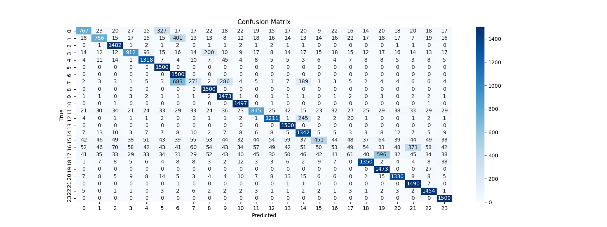

---

### 10B (0-9)

| Accuracy | Precision |
|:---------:|:-----------:|
| 47.78%  | 42.24%    |

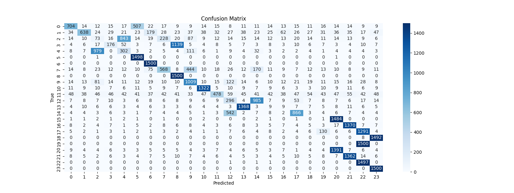

---

## Simplification Using Only Fingertip Joints

A further simplification was tested by retaining only fingertip-joint features: **TMd, IMd, MMd, RMd, LMd**. These joints exhibit the highest spatial variance, making them potentially more informative in state estimation.

---

## TQ-Learning – HGMSD-24 – Fingertips Only (10 Features)

### 2B (0-1)

| Accuracy | Precision |
|:---------:|:-----------:|
| 97.14%  | 97.25%    |

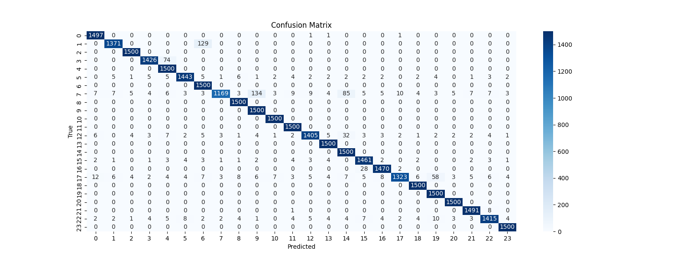

---

### 3B (0-2)

| Accuracy | Precision |
|:---------:|:-----------:|
| 92.97%  | 93.66%    |

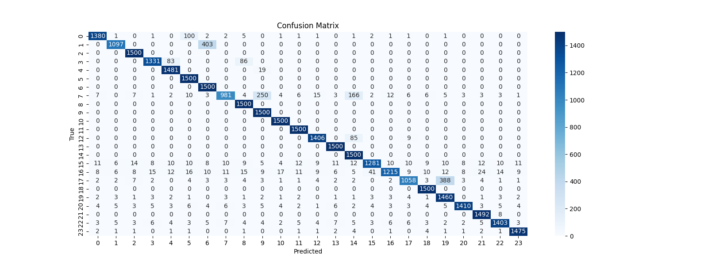

---

### 4B (0-3)

| Accuracy | Precision |
|:---------:|:-----------:|
| 83.90%  | 95.47%    |

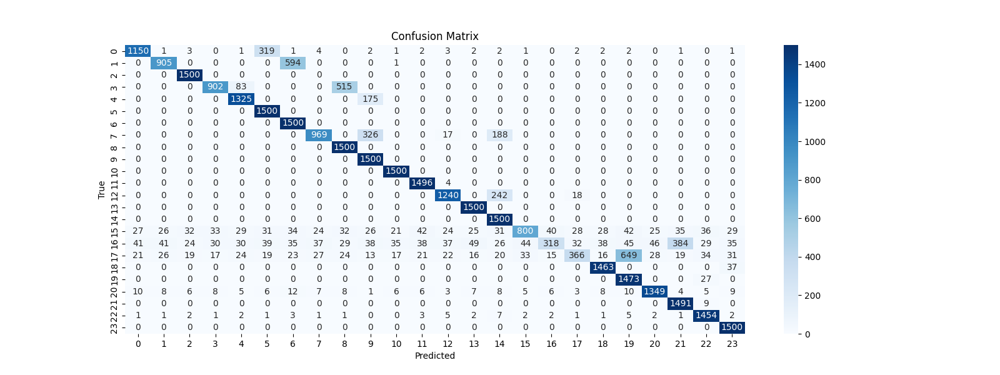

---

### 10B (0-9)

| Accuracy | Precision |
|:---------:|:-----------:|
| 50.42%  | 49.06%    |

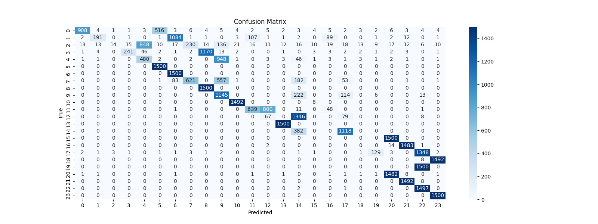

---

## Aggregation of Features by Finger

An alternative reduction strategy aggregated all features belonging to each finger by summation, followed by binning. This reduced the state space from 48 float variables to **10 integer values**, preserving macro-level movement information.

---

## TQ-Learning – HGMSD-24 – Aggregated Features (AF)

### 2B (0-1)

| Accuracy | Precision |
|:---------:|:-----------:|
| 79.87%  | 77.16%    |

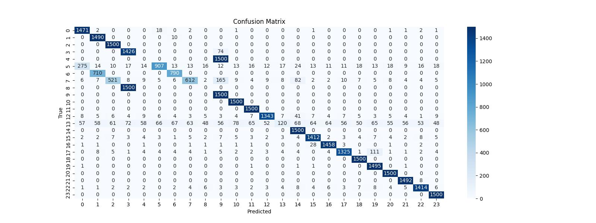

---

### 3B (0-2)

| Accuracy | Precision |
|:---------:|:-----------:|
| 58.22%  | 50.61%    |

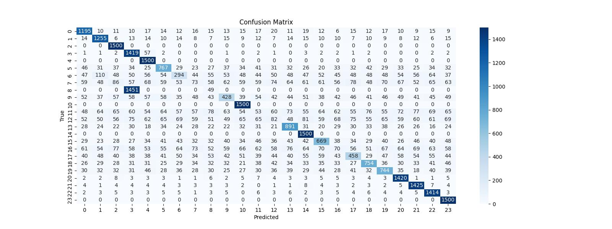

---

### 4B (0-3)

| Accuracy | Precision |
|:---------:|:-----------:|
| 51.67%  | 43.08%    |

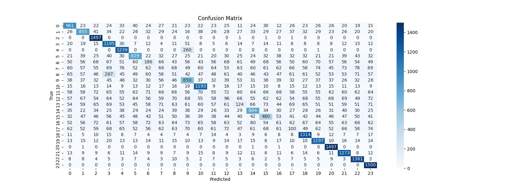

---

### 10B (0-9)

| Accuracy | Precision |
|:---------:|:-----------:|
| 26.13%  | 20.15%    |

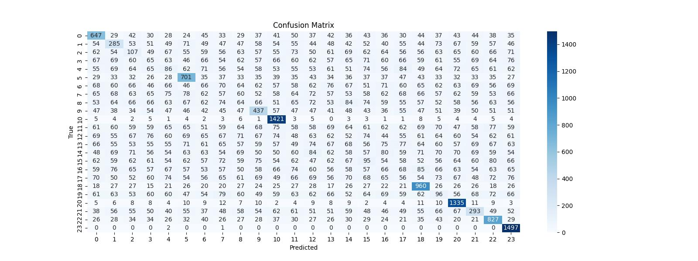

---

## Experiments on the Impact of Enlarging the Training Dataset

A degradation in performance was observed as the bin count increased. To investigate whether increasing the number of training states could mitigate this phenomenon, an additional experiment trained agents using **TestDataset24** and tested them on HGMSD-24.

---

## TQ-Learning – TestDataset24 – Aggregated Features (AF)

### 2B (0-1)

| Accuracy | Precision |
|:---------:|:-----------:|
| 53.50%  | 47.75%    |

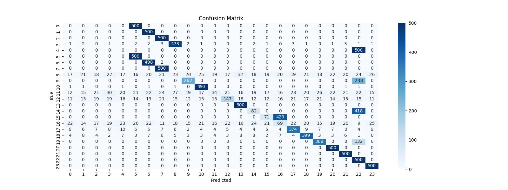

---

### 3B (0-2)

| Accuracy | Precision |
|:---------:|:-----------:|
| 69.35%  | 60.02%    |

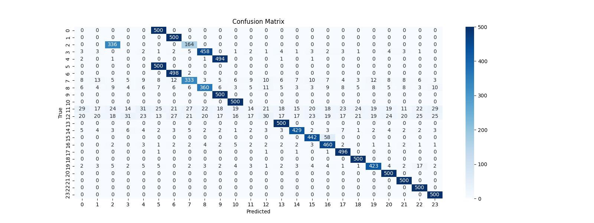

---

### 4B (0-3)

| Accuracy | Precision |
|:---------:|:-----------:|
| 65.70%  | 57.63%    |

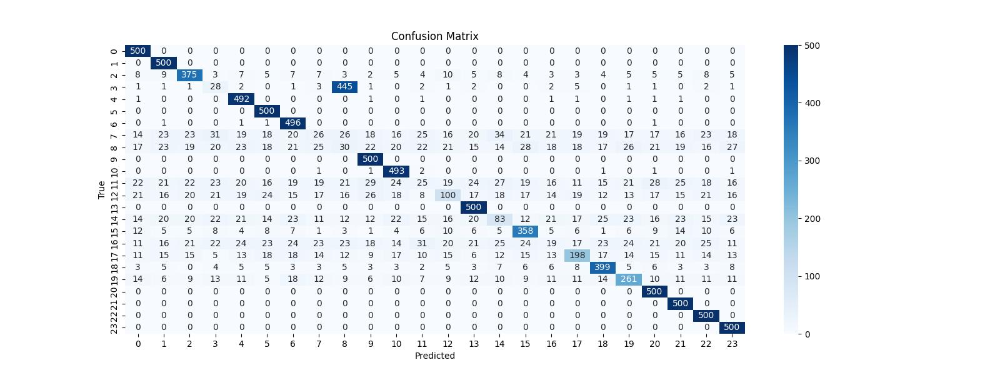

---

### 10B (0-9)

| Accuracy  |  Precision  |
|:---------:|:-----------:|
|  43.15%   |   32.17%    |

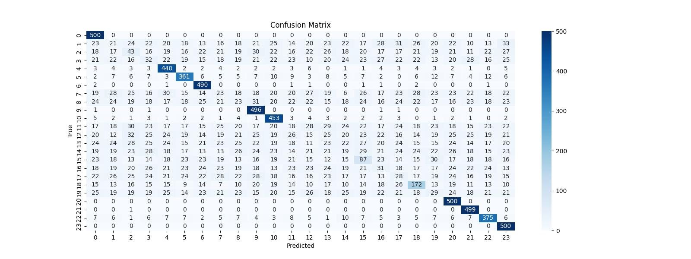

---

## Deep Q-Networks (DQN / DDQN)

### DQN – HGMSD-12

| Accuracy  |  Precision  |
|:---------:|:-----------:|
|  98.12%   |   98.20%    |


---

### DQN – HGMSD-24

| Accuracy  |  Precision  |
|:---------:|:-----------:|
|  98.93%   |   98.97%    |

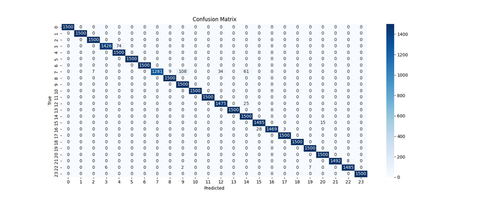

---

### Double DQN – HGMSD-12

| Accuracy  |  Precision  |
|:---------:|:-----------:|
|  97.35%   |   97.15%    |

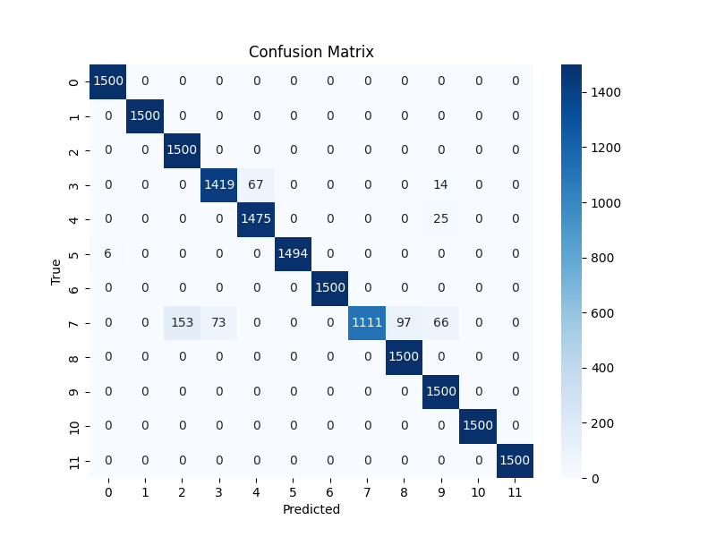

---

### Double DQN – HGMSD-24

| Accuracy  |  Precision  |
|:---------:|:-----------:|
|  98.33%   |   98.45%    |

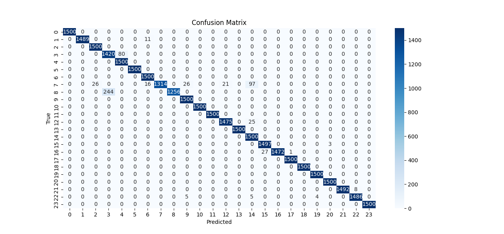

---

## Machine-Generated Datasets (MGMSD)

The objective of this method is to pretrain intelligent agents from a very small dataset and later refine them. To do this, the **Machine Generated MarcoSmiles's Dataset (MGMSD)** was created.  
The aim of this dataset is to provide a sufficient data collection for training intelligent agents while minimizing the time required for dataset creation.

Two datasets were created:

- **MGMSD-12**: single-octave data (6000 instances)  
- **MGMSD-24**: two-octave data (12000 instances)

Data augmentation was performed using a custom script that applies **jittering**. Small pseudo-random variations were added to each feature to simulate micro-movements that a user could perform during recording and execution.  
A value, randomly chosen from four options, is added to or subtracted from each feature to generate new rows and enrich the dataset.

```python
# Data augmentation
with open(file_path, mode='a', newline='') as file:
    writer = csv.writer(file)
    counter = 0
    for row in X:
        for i in range(500):
            tempArr = np.array([])
            # y contains the labels presented in the initial dataset
            tempArr = np.append(tempArr, str(y[counter]))
            for value in row:
                # The first instance remains untouched
                if i != 0:
                    # Formatting value with three decimal places
                    value = float(format(value, '.3f'))
                    # Generate noise value
                    int_random_val = random.randint(-2, 3)
                    variation = int_random_val * 0.001
                    finalvalue = value + variation
                    tempArr = np.append(tempArr, format(finalvalue, '.3f'))
                else:
                    tempArr = np.append(tempArr, value)
            writer.writerow(tempArr)
        counter += 1
```
### DQN – MGMSD-12

| Accuracy | Precision |
|:--------:|:---------:|
| 94.45%   | 95.58%    |

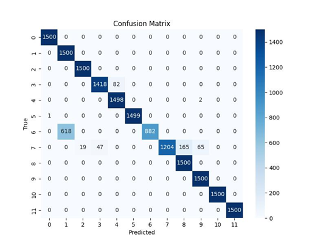

---

### DQN – MGMSD-24

| Accuracy | Precision |
|:--------:|:---------:|
| 97.77%   | 97.94%    |

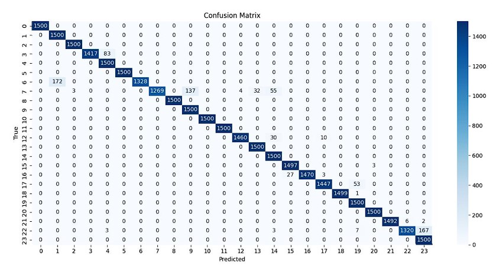

---

### Double DQN – MGMSD-12

| Accuracy | Precision |
|:--------:|:---------:|
| 97.10%   | 97.17%    |


---

### Double DQN – MGMSD-24

| Accuracy | Precision |
|:--------:|:---------:|
| 97.70%   | 97.85%    |


